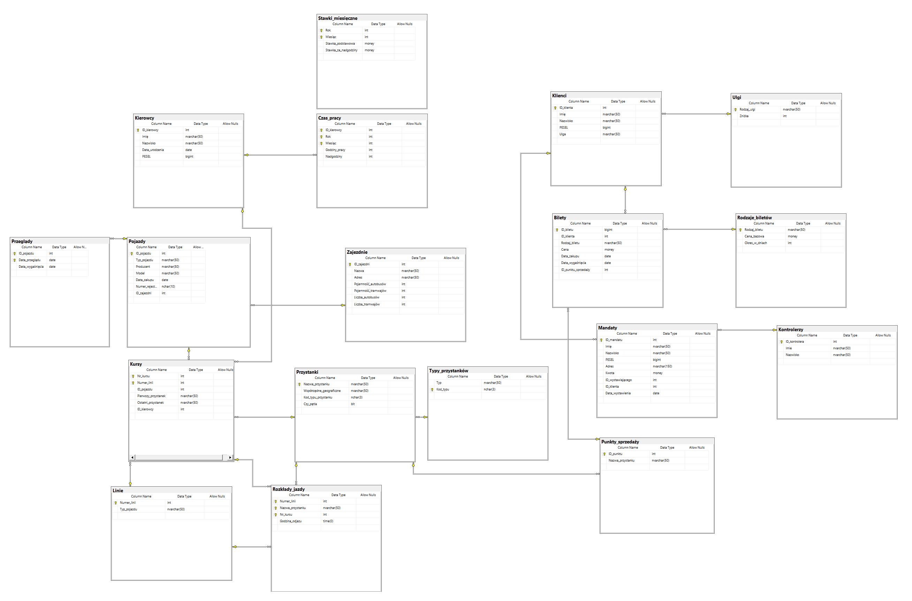

# Dokumentacja bazy MPK

<!-- tego nie ruszać, tu będzie główny dokument-->

## Założenia projektowe i opis

Baza danych MPK zawiera informacje o działaniu małego przedsiębiorstwa komunikacyjnego. Przechowuje informacje o pojazdach, przystankach, kierowcach i pasażerach, oraz powiązane z tymi zagadnieniami informacje. Największy nacisk położono na informacje o technicznej stronie funkcjonowania przedsiębiorstwa, to jest dokładnych informacjach o istniejących liniach, ich rozkładach jazdy, a także pojazdach oraz ich stanie technicznym.  

Przyjęte założenia:

- Czas pracy kierowcy podzielony jest na czas główny i nadgodziny, kierowcy są rozliczani w trybie miesięcznym
- Pojazdy zawsze muszą być przypisane do zajezdni (lub specjalnego typu zajezdni `Magazyn`)
- Zajezdnie mogą być typu autobusowego, tramwajowego lub mieszanego
- Możliwe typy pojazdów to autobus i tramwaj
- Jeden pojazd może być przypisany do wielu kursów
- Jeden kierowca może być przypisany do wielu kursów
- Może istnieć tylko jedna linia o podanym numerze, w obrębie linii może istnieć wiele kursów o unikatowych numerach identyfikacyjnych
- Kursy w obrębie linii mogą różnić się rozkładami jazdy
- Rozkład jazdy składa się z przystanków, oraz godzin odjazdu, kolejność rozkładu ustalają rosnące godziny odjazdów
- Przystanki są identyfikowane tylko swoją nazwą, ich lokalizacja jest określana na podstawie współrzędnych geograficznych
- Możliwe typy przystanków to autobusowy, tramwajowy i autobusowo-tramwajowy
- Przechowywane są informacje tylko o klientach posiadających bilety okresowe
- Klient może posiadać jedną ulgę, w przypadku różnych ulg wybierana jest najwyższa
- Przechowywana jest cała historia biletów okresowych, ich aktywność ustala się na podstawie daty wygaśnięcia
- Cena biletów pobierana jest z osobnej tabeli, __może zmieniać się w czasie__
- Bilety sprzedawane są w punktach sprzedaży, które są zlokalizowane tylko na przystankach
- Przechowywane są tylko informacje o nieuregulowanych mandatach, zapłacone są usuwane
- Mandat może być wystawiony przez kontrolera istniejącego w bazie danych przedsiębiorstwa lub przez zewnętrznych kontrolerów
- Numer identyfikacyjny mandatu ustalany jest przez wystawiającego
- Klient z niezapłaconym mandatem nie może zakupić biletu

## Diagram

